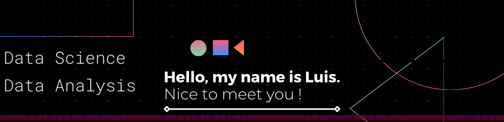

<!--    -->

  

# Luís Miguel

*PT-BR*  
Conhecedor de ciência de dados e amante de livros históricos, sou um jovem cientista de dados que aspira a uma grande carreira. Aliando à capacidade de análise crítica, trabalho em equipe, rapidez e organização, na criação de um projecto completo que vai além das expectativas e resultados, tendo já resolvido diversos problemas de natureza administrativa para empresas e agências.

Minhas credenciais incluem um curso técnico de Manutenção e Suporte em Informática pelo SENAI, uma das maiores e mais inovadoras instituições de ensino do Brasil e um Bacharelado em Ciência da Computação pela UFMA (Universidade Federal do Maranhão), a maior instituição de ensino do estado brasileiro do Maranhão

**Experiência em:** Python, Machine Learning, Web scrapping (B4S) e análise de vendas (time series)

 

*EN*  
Connoisseur of data science and lover of historical books, I am a young data scientist who aspires to a great career. combined with the capacity for critical analysis, teamwork, speed and organization, in the creation of a complete project that goes beyond expectations and results, having already solved several problems of an administrative nature for companies and agencies.

My credentials include a technical course on technical maintenance and IT support from SENAI, one of the largest and most innovative educational institutions in Brazil and a Bachelor of Computer Science from UFMA (Federal University of Maranhão), the largest educational institution in the state Brazilian from Maranhão

**Experience in:** Python, machine learning, Web scrapping (B4S) and sales analysis (time series)

**Links:**
* [LinkedIn](www.linkedin.com/in/Luis-Miguel-Code)
* [Medium](https://medium.com/@meireles2013miguel)

## Projetos:

* **Recebendo e transformando informações pessoas para o Formato BR com Python :** https://github.com/LuisMig-code/Recebendo-dados-e-colocando-em-formato-BR
* **Análise do desempenho de estudantes americanos em vestibulares :** https://github.com/LuisMig-code/analise-do-desempenho-de-estudantes | https://luis-miguel-code.medium.com/na-guerra-dos-estudante-quem-estuda-mais-f9ccd8fff646 
* **Usando Machine Learning na detecção de Câncer de mama :** https://github.com/LuisMig-code/Deteccao-de-carcer-de-mama-com-Machine-Learning | https://luis-miguel-code.medium.com/machine-learning-e-o-c%C3%A2ncer-de-mama-b0158e1a0939
* **Prevendo valores de Celulares usando Machine Learning e RFE** : https://github.com/LuisMig-code/Fazendo-Previs-es-em-Machine-Learning-usando-o-RFE | https://luis-miguel-code.medium.com/qual-o-pre%C3%A7o-desse-smartphone-machine-learning-aplicada-a-neg%C3%B3cios-28be78489d67
* **Prevendo o quão feliz um país é** : https://github.com/LuisMig-code/Prevendo-a-pontuacao-de-felicidade-de-uma-nacao
* **Análise Exploratória de dados de Restaurante nos EUA 2019-2020** : https://github.com/LuisMig-code/Analise-Exploratoria-de-Restaurantes-nos-EUA | https://luis-miguel-code.medium.com/como-os-restaurantes-se-sa%C3%ADram-em-2020-an%C3%A1lise-explorat%C3%B3ria-5cf3061a609f
* **Como fazer WEB SCRAPING usando a biblioteca BeautifulSoup** : https://github.com/LuisMig-code/Fazendo-web-scraping-com-a-biblioteca-BeautifulSoup | https://www.linkedin.com/pulse/por-que-eu-devo-aprender-web-scraping-lu%C3%ADs-miguel/

---

